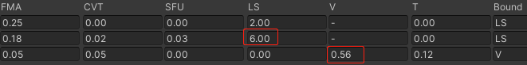

# 基于Malioc静态分析Shader
## Mali Offline Compiler
`malioc` 是`arm`推出的基于`mali GPU`的`shader`离线静态分析工具.

支持以下GPU
```
• Mali-T700 series (Midgard architecture)
• Mali-T800 series (Midgard architecture)
• Mali‑G31 (Bifrost architecture)
• Mali‑G51 and Mali‑G52 (Bifrost architecture)
• Mali‑G71, Mali-G72, and Mali-G76 (Bifrost architecture)
• Mali‑G57, Mali‑G68, Mali‑G77, and Mali‑G78 (Valhall architecture)
```

## 使用方法
命令行输入
```
malioc -c <target_gpu> [<shader_type>] <file1> [<file2> …] [-o <file>]
```
`shader_type`可输入
```
• --vertex
• --tessellation_control
• --tessellation_evaluation
• --geometry
• --fragment
• --compute
```
如果`file`已经使用了以下扩展名则无需指定`shader_type`
```
.vert OpenGL ES vertex shader.
.tesc OpenGL ES tessellation control shader.
.tese OpenGL ES tessellation evaluation shader.
.geom OpenGL ES geometry shader.
.frag OpenGL ES fragment shader.
.comp OpenGL ES compute shader.
```
用`-D`可以定义`Shader`中的宏来执行部分代码
```txt
-Dfoo
定义foo为1
-Dfoo=bar
定义foo为bar的值
```
## 性能分析
执行以下命令行代码
```txt
$ malioc.exe Unlit-test-LOD100.vert
```

得到以下性能数据
```txt
Mali Offline Compiler v7.4.0 (Build 330167)
Copyright 2007-2021 Arm Limited, all rights reserved

Configuration
=============

Hardware: Mali-G710 r0p0
Architecture: Valhall
Driver: r32p0-00rel0
Shader type: OpenGL ES Vertex

Main shader
===========

Position variant
----------------

Work registers: 19
Uniform registers: 44
Stack spilling: false
16-bit arithmetic: 0%

                              FMA     CVT     SFU      LS       T    Bound
Total instruction cycles:    0.25    0.00    0.00    2.00    0.00       LS
Shortest path cycles:        0.25    0.00    0.00    2.00    0.00       LS
Longest path cycles:         0.25    0.00    0.00    2.00    0.00       LS

FMA = Arith FMA, CVT = Arith CVT, SFU = Arith SFU, LS = Load/Store, T = Texture

Varying variant
---------------

Work registers: 7
Uniform registers: 12
Stack spilling: false
16-bit arithmetic: 0%

                              FMA     CVT     SFU      LS       T    Bound
Total instruction cycles:    0.02    0.00    0.00    3.00    0.00       LS
Shortest path cycles:        0.02    0.00    0.00    3.00    0.00       LS
Longest path cycles:         0.02    0.00    0.00    3.00    0.00       LS

FMA = Arith FMA, CVT = Arith CVT, SFU = Arith SFU, LS = Load/Store, T = Texture

Shader properties
=================

Has uniform computation: false
```
看到`vertex shader`被分为了`Position variant`和`Varing variant`两段. 在`Bifrost`和`Valhall`架构上, `.vert`会被`Index-Driven Vertex Shading (IDVS)`管线编译成两个`binaries`

- `Position shader`: 只有`position`相关计算
- `Varying Shader`: 计算剩下的所有`vertex attribute`


`Pos shader`对每一个索引顶点都会执行, `Varying shader`只对剔除后的可见图元执行, 所以这两个`shader`的数据被分开表示.  
原文:
>The position shader is executed for every index vertex, but the varying shader is only executed for vertices that are part of a visible primitive that survives culling. Mali Offline Compiler reports separate performance tables for each of these variants.

## Mali GPU 静态分析数据项
### Bifrost架构
- `Arithmetic unit (A)`  
  计算单元
- `Load/store unit (LS)`  
  执行所有非Texture的内存访问, 包括buffer, image和原子操作, 受`vertex`的结构大小影响
- `Varying unit (V)`  
  执行变量插值, 受`struct v2f`大小影响
- `Texture unit (T)`  
  执行所有纹理采样和过滤操作


#### Work registers
`Bifrost GPU shader core` 可以创建多个线程, 取决于正在使用的`Shader programs`的`work registers`数量

- `0-32 registers`:
Maximum thread capacity
- `33-64 registers`:
Half thread capacity  
所以如果比起`highp`, 尽可能使用更多的`mediump`的话就能创建更多线程来让`GPU`的负载上升从而提高性能

### Valhall 架构
`Valhall`有6种并行管线, 其中3种`arithmetic`管线和3种`fixted function support`管线

- `Arithmetic fused multiply accumulate unit (FMA)`  
FMA管线构建了16-wide warp, 每线程每时钟周期可以发出一个32-bit操作或者两个16bit操作  
> The FMA pipelines are the main arithmetic pipelines, implementing the floating-point multipliers that are widely used in shader code. Each FMA pipeline implements a 16-wide warp, and can issue a single 32-bit operation or two 16-bit operations per thread and per clock cycle.

- `Arithmetic convert unit (CVT)`  
类型转换单元
>The CVT pipelines implement simple operations, such as format conversion and integer
addition.

- `Arithmetic special functions unit (SFU)`  
特殊运算单元, 用于执行倒数和[超越函数](https://zh.wikipedia.org/wiki/%E8%B6%85%E8%B6%8A%E5%87%BD%E6%95%B8). 
> Each SFU pipeline implements a 4-wide issue path, executing a 16-wide warp over 4 clock cycles

- `Load/store unit (LS)` 
- `Varying unit (V)`
- `Texture unit (T)`  


## 测试各项数据
### 1. 基准Shader
以最基础的shader, 顶点只有pos和uv, 且采样一次纹理并输出结果作为基准shader. 再添加其它代码观察各项数据的变化
<details><summary><strong>代码（点击）</strong></summary>

```
Shader "Unlit/benchShader"
{
    Properties
    {
        _MainTex ("Texture", 2D) = "white" {}
    }
    SubShader
    {
        Tags { "RenderType"="Opaque" }
        LOD 100

        Pass
        {
            CGPROGRAM
            #pragma vertex vert
            #pragma fragment frag

            #include "UnityCG.cginc"

            struct appdata
            {
                float4 vertex : POSITION;
                float2 uv : TEXCOORD0;
            };

            struct v2f
            {
                float2 uv : TEXCOORD0;
                float4 vertex : SV_POSITION;
            };

            sampler2D _MainTex;
            float4 _MainTex_ST;

            v2f vert (appdata v)
            {
                v2f o;
                o.vertex = UnityObjectToClipPos(v.vertex);
                o.uv = TRANSFORM_TEX(v.uv, _MainTex);
                return o;
            }

            fixed4 frag (v2f i) : SV_Target
            {
                // sample the texture
                fixed4 col = tex2D(_MainTex, i.uv);
                return col;
            }
            ENDCG
        }
    }
}

=======================================================================

#version 300 es

#define HLSLCC_ENABLE_UNIFORM_BUFFERS 1
#if HLSLCC_ENABLE_UNIFORM_BUFFERS
#define UNITY_UNIFORM
#else
#define UNITY_UNIFORM uniform
#endif
#define UNITY_SUPPORTS_UNIFORM_LOCATION 1
#if UNITY_SUPPORTS_UNIFORM_LOCATION
#define UNITY_LOCATION(x) layout(location = x)
#define UNITY_BINDING(x) layout(binding = x, std140)
#else
#define UNITY_LOCATION(x)
#define UNITY_BINDING(x) layout(std140)
#endif
uniform 	vec4 hlslcc_mtx4x4unity_ObjectToWorld[4];
uniform 	vec4 hlslcc_mtx4x4unity_MatrixVP[4];
uniform 	vec4 _MainTex_ST;
in highp vec4 in_POSITION0;
in highp vec2 in_TEXCOORD0;
out highp vec2 vs_TEXCOORD0;
vec4 u_xlat0;
vec4 u_xlat1;
void main()
{
    vs_TEXCOORD0.xy = in_TEXCOORD0.xy * _MainTex_ST.xy + _MainTex_ST.zw;
    u_xlat0 = in_POSITION0.yyyy * hlslcc_mtx4x4unity_ObjectToWorld[1];
    u_xlat0 = hlslcc_mtx4x4unity_ObjectToWorld[0] * in_POSITION0.xxxx + u_xlat0;
    u_xlat0 = hlslcc_mtx4x4unity_ObjectToWorld[2] * in_POSITION0.zzzz + u_xlat0;
    u_xlat0 = u_xlat0 + hlslcc_mtx4x4unity_ObjectToWorld[3];
    u_xlat1 = u_xlat0.yyyy * hlslcc_mtx4x4unity_MatrixVP[1];
    u_xlat1 = hlslcc_mtx4x4unity_MatrixVP[0] * u_xlat0.xxxx + u_xlat1;
    u_xlat1 = hlslcc_mtx4x4unity_MatrixVP[2] * u_xlat0.zzzz + u_xlat1;
    gl_Position = hlslcc_mtx4x4unity_MatrixVP[3] * u_xlat0.wwww + u_xlat1;
    return;
}

==============================================================================

#version 300 es

precision highp float;
precision highp int;
#define UNITY_SUPPORTS_UNIFORM_LOCATION 1
#if UNITY_SUPPORTS_UNIFORM_LOCATION
#define UNITY_LOCATION(x) layout(location = x)
#define UNITY_BINDING(x) layout(binding = x, std140)
#else
#define UNITY_LOCATION(x)
#define UNITY_BINDING(x) layout(std140)
#endif
UNITY_LOCATION(0) uniform mediump sampler2D _MainTex;
in highp vec2 vs_TEXCOORD0;
layout(location = 0) out mediump vec4 SV_Target0;
mediump vec4 u_xlat16_0;
void main()
{
    u_xlat16_0 = texture(_MainTex, vs_TEXCOORD0.xy);
    SV_Target0 = u_xlat16_0;
    return;
}


```

</details>

分析结果  


### 2. 采样两次
<details><summary><strong>代码（点击）</strong></summary>

```
v2f vert (appdata v)
{
    v2f o;
    o.vertex = UnityObjectToClipPos(v.vertex);
    o.uv = TRANSFORM_TEX(v.uv, _MainTex);
    return o;
}

fixed4 frag (v2f i) : SV_Target
{
    // sample the texture
    fixed4 col = tex2D(_MainTex, i.uv);
    col.rg = tex2D(_MainTex, i.uv + float2(0, 1));
    return col;
}

===========================================================

#version 300 es

precision highp float;
precision highp int;
#define UNITY_SUPPORTS_UNIFORM_LOCATION 1
#if UNITY_SUPPORTS_UNIFORM_LOCATION
#define UNITY_LOCATION(x) layout(location = x)
#define UNITY_BINDING(x) layout(binding = x, std140)
#else
#define UNITY_LOCATION(x)
#define UNITY_BINDING(x) layout(std140)
#endif
UNITY_LOCATION(0) uniform mediump sampler2D _MainTex;
in highp vec2 vs_TEXCOORD0;
layout(location = 0) out mediump vec4 SV_Target0;
vec4 u_xlat0;
void main()
{
    u_xlat0.xy = vs_TEXCOORD0.xy + vec2(0.0, 1.0);
    u_xlat0.xy = texture(_MainTex, u_xlat0.xy).xy;
    u_xlat0.zw = texture(_MainTex, vs_TEXCOORD0.xy).zw;
    SV_Target0 = u_xlat0;
    return;
}

```
</details>

分析结果  


### 3. 添加顶点法线
<details><summary><strong>代码（点击）</strong></summary>
<!-- </details> -->

```
struct appdata
{
    float4 vertex : POSITION;
    float3 normal: NORMAL; // 顶点法线
    float2 uv1 : TEXCOORD0;
};

struct v2f
{
    float4 vertex : SV_POSITION;
    float3 normalWorld: TEXCOORD1;
    float2 uv1 : TEXCOORD0;
};

sampler2D _MainTex;
float4 _MainTex_ST;

v2f vert (appdata v)
{
    v2f o;
    o.vertex = UnityObjectToClipPos(v.vertex);
    o.uv1 = TRANSFORM_TEX(v.uv1, _MainTex);
    o.normalWorld = UnityObjectToWorldNormal(v.normal);
    return o;
}

fixed4 frag (v2f i) : SV_Target
{
    // sample the texture
    half2 uv = i.uv1;
    fixed4 col = tex2D(_MainTex, uv);
    col.rg = i.normalWorld.xy;
    return col;
}
===============================================================

#version 300 es

#define HLSLCC_ENABLE_UNIFORM_BUFFERS 1
#if HLSLCC_ENABLE_UNIFORM_BUFFERS
#define UNITY_UNIFORM
#else
#define UNITY_UNIFORM uniform
#endif
#define UNITY_SUPPORTS_UNIFORM_LOCATION 1
#if UNITY_SUPPORTS_UNIFORM_LOCATION
#define UNITY_LOCATION(x) layout(location = x)
#define UNITY_BINDING(x) layout(binding = x, std140)
#else
#define UNITY_LOCATION(x)
#define UNITY_BINDING(x) layout(std140)
#endif
uniform 	vec4 hlslcc_mtx4x4unity_ObjectToWorld[4];
uniform 	vec4 hlslcc_mtx4x4unity_WorldToObject[4];
uniform 	vec4 hlslcc_mtx4x4unity_MatrixVP[4];
uniform 	vec4 _MainTex_ST;
in highp vec4 in_POSITION0;
in highp vec3 in_NORMAL0;
in highp vec2 in_TEXCOORD0;
out highp vec3 vs_TEXCOORD1;
out highp vec2 vs_TEXCOORD0;
vec4 u_xlat0;
vec4 u_xlat1;
float u_xlat6;
void main()
{
    u_xlat0 = in_POSITION0.yyyy * hlslcc_mtx4x4unity_ObjectToWorld[1];
    u_xlat0 = hlslcc_mtx4x4unity_ObjectToWorld[0] * in_POSITION0.xxxx + u_xlat0;
    u_xlat0 = hlslcc_mtx4x4unity_ObjectToWorld[2] * in_POSITION0.zzzz + u_xlat0;
    u_xlat0 = u_xlat0 + hlslcc_mtx4x4unity_ObjectToWorld[3];
    u_xlat1 = u_xlat0.yyyy * hlslcc_mtx4x4unity_MatrixVP[1];
    u_xlat1 = hlslcc_mtx4x4unity_MatrixVP[0] * u_xlat0.xxxx + u_xlat1;
    u_xlat1 = hlslcc_mtx4x4unity_MatrixVP[2] * u_xlat0.zzzz + u_xlat1;
    gl_Position = hlslcc_mtx4x4unity_MatrixVP[3] * u_xlat0.wwww + u_xlat1;
    u_xlat0.x = dot(in_NORMAL0.xyz, hlslcc_mtx4x4unity_WorldToObject[0].xyz);
    u_xlat0.y = dot(in_NORMAL0.xyz, hlslcc_mtx4x4unity_WorldToObject[1].xyz);
    u_xlat0.z = dot(in_NORMAL0.xyz, hlslcc_mtx4x4unity_WorldToObject[2].xyz);
    u_xlat6 = dot(u_xlat0.xyz, u_xlat0.xyz);
    u_xlat6 = inversesqrt(u_xlat6);
    vs_TEXCOORD1.xyz = vec3(u_xlat6) * u_xlat0.xyz;
    vs_TEXCOORD0.xy = in_TEXCOORD0.xy * _MainTex_ST.xy + _MainTex_ST.zw;
    return;
}


===========================================================================
#version 300 es

precision highp float;
precision highp int;
#define UNITY_SUPPORTS_UNIFORM_LOCATION 1
#if UNITY_SUPPORTS_UNIFORM_LOCATION
#define UNITY_LOCATION(x) layout(location = x)
#define UNITY_BINDING(x) layout(binding = x, std140)
#else
#define UNITY_LOCATION(x)
#define UNITY_BINDING(x) layout(std140)
#endif
UNITY_LOCATION(0) uniform mediump sampler2D _MainTex;
in highp vec3 vs_TEXCOORD1;
in highp vec2 vs_TEXCOORD0;
layout(location = 0) out mediump vec4 SV_Target0;
vec4 u_xlat0;
void main()
{
    u_xlat0.zw = texture(_MainTex, vs_TEXCOORD0.xy).zw;
    u_xlat0.xy = vs_TEXCOORD1.xy;
    SV_Target0 = u_xlat0;
    return;
}


```
</details>

分析结果  


1. `o.normalWorld = UnityObjectToWorldNormal(v.normal);`转换法线到世界空间后做了`normalize`, 使用了`inversesqrt`, 增加了`SFU`
2. 新增了`in highp vec3 in_NORMAL0;`和`out highp vec3 vs_TEXCOORD1`使得`LS`和`V`上升.

### 4. 添加半精度顶点法线
<details><summary><strong>代码（点击）</strong></summary>

```
struct appdata
{
    float4 vertex : POSITION;
    half3 normal: NORMAL;
    float2 uv : TEXCOORD0;
};

struct v2f
{
    float4 vertex : SV_POSITION;
    half3 normalWorld: TEXCOORD1;
    float2 uv : TEXCOORD0;
};
====================================
in mediump vec3 in_NORMAL0;
out mediump vec3 vs_TEXCOORD1;

```

</details>

分析结果  
  
改为半精度后`V`开销下降, `SFU`不变

### 5. 两套uv
添加第二套uv, 但不传给`Fragment shader`

<details><summary><strong>代码（点击）</strong></summary>

```
struct appdata
{
    float4 vertex : POSITION;
    half3 normal: NORMAL;
    half2 uv1 : TEXCOORD0;
    half2 uv2 : TEXCOORD1;
};

struct v2f
{
    float4 vertex : SV_POSITION;
    half3 normalWorld: TEXCOORD1;
    half2 uv1 : TEXCOORD0;
};
====================================
in mediump vec3 in_NORMAL0;
in mediump vec2 in_TEXCOORD0;
in mediump vec2 in_TEXCOORD1;
out mediump vec3 vs_TEXCOORD1;
out mediump vec2 vs_TEXCOORD0;

```

</details>

分析结果  


appData结构体属性越多, `VAO`越大造成`LS`上升

### 6. 增大v2f不改变appData
<details><summary><strong>代码（点击）</strong></summary>

```
struct appdata
{
    float4 vertex : POSITION;
    half3 normal: NORMAL;
    half2 uv1 : TEXCOORD0;
    half2 uv2 : TEXCOORD1;
};

struct v2f
{
    float4 vertex : SV_POSITION;
    half3 normalWorld: TEXCOORD1;
    half2 uv1 : TEXCOORD0;
    half2 uv2 : TEXCOORD2;
    half4 uv34 : TEXCOORD3;
};

sampler2D _MainTex;
float4 _MainTex_ST;

v2f vert (appdata v)
{
    v2f o;
    o.vertex = UnityObjectToClipPos(v.vertex);
    o.uv1 = TRANSFORM_TEX(v.uv1, _MainTex);
    o.uv2 = TRANSFORM_TEX(v.uv2, _MainTex);;
    o.uv34.xy = saturate(o.uv1 + 0.1);
    o.uv34.zw = saturate(o.uv2 - 0.1);
    o.normalWorld = UnityObjectToWorldNormal(v.normal);
    return o;
}

fixed4 frag (v2f i) : SV_Target
{
    // sample the texture
    half2 uv = (i.uv1 + i.uv2 + i.uv34.xy + i.uv34.zw) * 0.25;
    fixed4 col = tex2D(_MainTex, uv);
    col.r = i.normalWorld.x;
    return col;
}
======================================
in mediump vec3 in_NORMAL0;
in mediump vec2 in_TEXCOORD0;
in mediump vec2 in_TEXCOORD1;
out mediump vec3 vs_TEXCOORD1;
out mediump vec2 vs_TEXCOORD0;
out mediump vec2 vs_TEXCOORD2;
out mediump vec4 vs_TEXCOORD3;


```
</details>

分析结果  
  
在`case4`的基础上, 将`v2f`增加一个`half2`和`half4`只使varying的cycles数量上升, LS不变.

### 7. 合并half4
将多个half2合并成half4
<details><summary><strong>代码（点击）</strong></summary>

```
struct appdata
{
    float4 vertex : POSITION;
    half3 normal: NORMAL;
    half4 uv12 : TEXCOORD0;
};

struct v2f
{
    float4 vertex : SV_POSITION;
    half3 normalWorld: TEXCOORD1;
    half4 uv12 : TEXCOORD0;
    half4 uv34 : TEXCOORD2;
};

sampler2D _MainTex;
float4 _MainTex_ST;

v2f vert (appdata v)
{
    v2f o;
    o.vertex = UnityObjectToClipPos(v.vertex);
    o.uv12.xy = TRANSFORM_TEX(v.uv12.xy, _MainTex);
    o.uv12.zw = TRANSFORM_TEX(v.uv12.zw, _MainTex);;
    o.uv34.xy = saturate(o.uv12.xy + 0.1);
    o.uv34.zw = saturate(o.uv12.zw - 0.1);
    o.normalWorld = UnityObjectToWorldNormal(v.normal);
    return o;
}

fixed4 frag (v2f i) : SV_Target
{
    // sample the texture
    half2 uv = (i.uv12.xy + i.uv12.zw + i.uv34.xy + i.uv34.zw) * 0.25;
    fixed4 col = tex2D(_MainTex, uv);
    col.r = i.normalWorld.x;
    return col;
}
============================================
in mediump vec3 in_NORMAL0;
in mediump vec4 in_TEXCOORD0;
out mediump vec3 vs_TEXCOORD1;
out mediump vec4 vs_TEXCOORD0;
out mediump vec4 vs_TEXCOORD2;

```
</details>

分析结果  
  
`appdata`合并后`LS`下降, `varying`不变

### 8. 增加多个uniform变量
<details><summary><strong>代码（点击）</strong></summary>

```
float param1;
float param2;
float param3;
float param4;
float param5;
float param6;

struct appdata
{
    float4 vertex : POSITION;
    half3 normal: NORMAL;
    half4 uv12 : TEXCOORD0;
};

struct v2f
{
    float4 vertex : SV_POSITION;
    half3 normalWorld: TEXCOORD1;
    half4 uv12 : TEXCOORD0;
    half4 uv34 : TEXCOORD2;
};

sampler2D _MainTex;
float4 _MainTex_ST;

v2f vert (appdata v)
{
    v2f o;
    float param = (param1+param2+param3+param4+param5+param6) / 6.0;
    o.vertex = UnityObjectToClipPos(v.vertex);
    o.uv12.xy = TRANSFORM_TEX(v.uv12.xy, _MainTex);
    o.uv12.zw = TRANSFORM_TEX(v.uv12.zw, _MainTex);;
    o.uv34.xy = saturate(o.uv12.xy + param);
    o.uv34.zw = saturate(o.uv12.zw - 0.1);
    o.normalWorld = UnityObjectToWorldNormal(v.normal);
    return o;
}

fixed4 frag (v2f i) : SV_Target
{
    // sample the texture
    half2 uv = (i.uv12.xy + i.uv12.zw + i.uv34.xy + i.uv34.zw) * 0.25;
    fixed4 col = tex2D(_MainTex, uv);
    col.r = i.normalWorld.x;
    return col;
}
=========================================================================
#version 300 es

#define HLSLCC_ENABLE_UNIFORM_BUFFERS 1
#if HLSLCC_ENABLE_UNIFORM_BUFFERS
#define UNITY_UNIFORM
#else
#define UNITY_UNIFORM uniform
#endif
#define UNITY_SUPPORTS_UNIFORM_LOCATION 1
#if UNITY_SUPPORTS_UNIFORM_LOCATION
#define UNITY_LOCATION(x) layout(location = x)
#define UNITY_BINDING(x) layout(binding = x, std140)
#else
#define UNITY_LOCATION(x)
#define UNITY_BINDING(x) layout(std140)
#endif
uniform 	vec4 hlslcc_mtx4x4unity_ObjectToWorld[4];
uniform 	vec4 hlslcc_mtx4x4unity_WorldToObject[4];
uniform 	vec4 hlslcc_mtx4x4unity_MatrixVP[4];
uniform 	float param1;
uniform 	float param2;
uniform 	float param3;
uniform 	float param4;
uniform 	float param5;
uniform 	float param6;
uniform 	vec4 _MainTex_ST;
in highp vec4 in_POSITION0;
in mediump vec3 in_NORMAL0;
in mediump vec4 in_TEXCOORD0;
out mediump vec3 vs_TEXCOORD1;
out mediump vec4 vs_TEXCOORD0;
out mediump vec4 vs_TEXCOORD2;
vec4 u_xlat0;
vec4 u_xlat1;
float u_xlat6;
void main()
{
    u_xlat0 = in_POSITION0.yyyy * hlslcc_mtx4x4unity_ObjectToWorld[1];
    u_xlat0 = hlslcc_mtx4x4unity_ObjectToWorld[0] * in_POSITION0.xxxx + u_xlat0;
    u_xlat0 = hlslcc_mtx4x4unity_ObjectToWorld[2] * in_POSITION0.zzzz + u_xlat0;
    u_xlat0 = u_xlat0 + hlslcc_mtx4x4unity_ObjectToWorld[3];
    u_xlat1 = u_xlat0.yyyy * hlslcc_mtx4x4unity_MatrixVP[1];
    u_xlat1 = hlslcc_mtx4x4unity_MatrixVP[0] * u_xlat0.xxxx + u_xlat1;
    u_xlat1 = hlslcc_mtx4x4unity_MatrixVP[2] * u_xlat0.zzzz + u_xlat1;
    gl_Position = hlslcc_mtx4x4unity_MatrixVP[3] * u_xlat0.wwww + u_xlat1;
    u_xlat0.x = dot(in_NORMAL0.xyz, hlslcc_mtx4x4unity_WorldToObject[0].xyz);
    u_xlat0.y = dot(in_NORMAL0.xyz, hlslcc_mtx4x4unity_WorldToObject[1].xyz);
    u_xlat0.z = dot(in_NORMAL0.xyz, hlslcc_mtx4x4unity_WorldToObject[2].xyz);
    u_xlat6 = dot(u_xlat0.xyz, u_xlat0.xyz);
    u_xlat6 = inversesqrt(u_xlat6);
    u_xlat0.xyz = vec3(u_xlat6) * u_xlat0.xyz;
    vs_TEXCOORD1.xyz = u_xlat0.xyz;
    u_xlat0 = in_TEXCOORD0 * _MainTex_ST.xyxy + _MainTex_ST.zwzw;
    vs_TEXCOORD0 = u_xlat0;
    u_xlat1.x = param2 + param1;
    u_xlat1.x = u_xlat1.x + param3;
    u_xlat1.x = u_xlat1.x + param4;
    u_xlat1.x = u_xlat1.x + param5;
    u_xlat1.x = u_xlat1.x + param6;
    u_xlat0.xy = u_xlat1.xx * vec2(0.166666672, 0.166666672) + u_xlat0.xy;
#ifdef UNITY_ADRENO_ES3
    u_xlat0.xy = min(max(u_xlat0.xy, 0.0), 1.0);
#else
    u_xlat0.xy = clamp(u_xlat0.xy, 0.0, 1.0);
#endif
    vs_TEXCOORD2.zw = u_xlat0.zw + vec2(-0.100000001, -0.100000001);
#ifdef UNITY_ADRENO_ES3
    vs_TEXCOORD2.zw = min(max(vs_TEXCOORD2.zw, 0.0), 1.0);
#else
    vs_TEXCOORD2.zw = clamp(vs_TEXCOORD2.zw, 0.0, 1.0);
#endif
    vs_TEXCOORD2.xy = u_xlat0.xy;
    return;
}

```
</details>

分析结果  
  
添加`Uniform`不影响`LS`

### CVT的实验对照
对`CVT`描述的的`integer addition`操作也会导致其上升抱有疑问, 做一组实验对照
#### 对照组1: 在基准shader的frag中添加int临时变量, 执行integer addition后赋值到输出
<details><summary>代码（点击）</summary>

```

int paramsx;
fixed4 frag (v2f i) : SV_Target
{
    fixed4 col = tex2D(_MainTex, i.uv);
    int tmp = 0;
    tmp += paramsx;
    col.a = saturate(tmp);
    return col;
}

==================Fragment===================
#version 300 es

precision highp float;
precision highp int;
#define HLSLCC_ENABLE_UNIFORM_BUFFERS 1
#if HLSLCC_ENABLE_UNIFORM_BUFFERS
#define UNITY_UNIFORM
#else
#define UNITY_UNIFORM uniform
#endif
#define UNITY_SUPPORTS_UNIFORM_LOCATION 1
#if UNITY_SUPPORTS_UNIFORM_LOCATION
#define UNITY_LOCATION(x) layout(location = x)
#define UNITY_BINDING(x) layout(binding = x, std140)
#else
#define UNITY_LOCATION(x)
#define UNITY_BINDING(x) layout(std140)
#endif
uniform 	int paramsx;
UNITY_LOCATION(0) uniform mediump sampler2D _MainTex;
in highp vec2 vs_TEXCOORD0;
layout(location = 0) out mediump vec4 SV_Target0;
vec4 u_xlat0;
float u_xlat3;
void main()
{
    u_xlat3 = float(paramsx);
    u_xlat0.w = u_xlat3;
#ifdef UNITY_ADRENO_ES3
    u_xlat0.w = min(max(u_xlat0.w, 0.0), 1.0);
#else
    u_xlat0.w = clamp(u_xlat0.w, 0.0, 1.0);
#endif
    u_xlat0.xyz = texture(_MainTex, vs_TEXCOORD0.xy).xyz;
    SV_Target0 = u_xlat0;
    return;
}

```
</details>

分析结果  


#### 对照组2: 在基准shader的frag中对输出结果col直接执行Integer add
<details><summary>代码（点击）</summary>

```

int paramsx;
fixed4 frag (v2f i) : SV_Target
{
    float4 col = tex2D(_MainTex, i.uv);
    return col;
}

==================Fragment===================
#version 300 es

precision highp float;
precision highp int;
#define HLSLCC_ENABLE_UNIFORM_BUFFERS 1
#if HLSLCC_ENABLE_UNIFORM_BUFFERS
#define UNITY_UNIFORM
#else
#define UNITY_UNIFORM uniform
#endif
#define UNITY_SUPPORTS_UNIFORM_LOCATION 1
#if UNITY_SUPPORTS_UNIFORM_LOCATION
#define UNITY_LOCATION(x) layout(location = x)
#define UNITY_BINDING(x) layout(binding = x, std140)
#else
#define UNITY_LOCATION(x)
#define UNITY_BINDING(x) layout(std140)
#endif
uniform 	int paramsx;
UNITY_LOCATION(0) uniform mediump sampler2D _MainTex;
in highp vec2 vs_TEXCOORD0;
layout(location = 0) out mediump vec4 SV_Target0;
mediump float u_xlat16_0;
mediump vec4 u_xlat16_1;
void main()
{
    u_xlat16_0 = float(paramsx);
    u_xlat16_1 = texture(_MainTex, vs_TEXCOORD0.xy);
    SV_Target0.w = u_xlat16_0 + u_xlat16_1.w;
#ifdef UNITY_ADRENO_ES3
    SV_Target0.w = min(max(SV_Target0.w, 0.0), 1.0);
#else
    SV_Target0.w = clamp(SV_Target0.w, 0.0, 1.0);
#endif
    SV_Target0.xyz = u_xlat16_1.xyz;
    return;
}

```
</details>

分析结果  
  
1. 对比基准`shader`并没有上升, 为了排除是加法次数太少造成的误差, 做了一组24次`integer addition`的对照结果也是相同的. 所以`Integer addtion`操作数并不会带来`CVT`上升. 
2. `int`->`float`的转换也不会带来`CVT`的明显上升, 如果有4的倍数的int, 编译器会将`int`组装成`ivec4`再转换成`vec4`, 基本无开销. 但是如果按`对照组1`使用了`int`临时变量, 那么会占用一个高精度的`register`, 然后在赋值给`col`时进行了`highp -> medium`的转换导致`CVT`上升.


### LS的进一步分析
#### 实验组1: 基准shader中的`v2f`添加`float4 params`
`params`只使用`uv`计算

<details><summary>代码（点击）</summary>

```
struct v2f
{
    float4 vertex : SV_POSITION;
    float2 uv : TEXCOORD0;
    float4 params : TEXCOORD1;
};

sampler2D _MainTex;
float4 _MainTex_ST;

v2f vert (appdata v)
{
    v2f o;
    o.vertex = UnityObjectToClipPos(v.vertex);
    o.uv = TRANSFORM_TEX(v.uv, _MainTex);
    o.params.xy = o.uv * o.uv;
    return o;
}

==================Fragment===================
#version 300 es

#define HLSLCC_ENABLE_UNIFORM_BUFFERS 1
#if HLSLCC_ENABLE_UNIFORM_BUFFERS
#define UNITY_UNIFORM
#else
#define UNITY_UNIFORM uniform
#endif
#define UNITY_SUPPORTS_UNIFORM_LOCATION 1
#if UNITY_SUPPORTS_UNIFORM_LOCATION
#define UNITY_LOCATION(x) layout(location = x)
#define UNITY_BINDING(x) layout(binding = x, std140)
#else
#define UNITY_LOCATION(x)
#define UNITY_BINDING(x) layout(std140)
#endif
uniform 	vec4 hlslcc_mtx4x4unity_ObjectToWorld[4];
uniform 	vec4 hlslcc_mtx4x4unity_MatrixVP[4];
uniform 	vec4 _MainTex_ST;
in highp vec4 in_POSITION0;
in highp vec2 in_TEXCOORD0;
out highp vec2 vs_TEXCOORD0;
out mediump vec4 vs_TEXCOORD1;
vec4 u_xlat0;
vec4 u_xlat1;
void main()
{
    u_xlat0 = in_POSITION0.yyyy * hlslcc_mtx4x4unity_ObjectToWorld[1];
    u_xlat0 = hlslcc_mtx4x4unity_ObjectToWorld[0] * in_POSITION0.xxxx + u_xlat0;
    u_xlat0 = hlslcc_mtx4x4unity_ObjectToWorld[2] * in_POSITION0.zzzz + u_xlat0;
    u_xlat0 = u_xlat0 + hlslcc_mtx4x4unity_ObjectToWorld[3];
    u_xlat1 = u_xlat0.yyyy * hlslcc_mtx4x4unity_MatrixVP[1];
    u_xlat1 = hlslcc_mtx4x4unity_MatrixVP[0] * u_xlat0.xxxx + u_xlat1;
    u_xlat1 = hlslcc_mtx4x4unity_MatrixVP[2] * u_xlat0.zzzz + u_xlat1;
    gl_Position = hlslcc_mtx4x4unity_MatrixVP[3] * u_xlat0.wwww + u_xlat1;
    u_xlat0.xy = in_TEXCOORD0.xy * _MainTex_ST.xy + _MainTex_ST.zw;
    vs_TEXCOORD0.xy = u_xlat0.xy;
    u_xlat0.xy = u_xlat0.xy * u_xlat0.xy;
    vs_TEXCOORD1.xy = u_xlat0.xy;
    return;
}


```
</details>

分析结果  
  
`LS`并无变化

#### 实验组2: `vertex`参与`params`计算
```
o.params.xy = o.vertex.xy * o.uv;
```
分析结果  
  
`LS`上升`2 cycles`, 如果将`params`改为`half4`则只上升`1 cycles`. 由于`IDVS`架构将`vertex shader`分成了`varying shader`和`position shader`, 如果在`varying shader`的变量计算中使用了`position shader`的变量则会造成`LS`上升.


## 总结
- `FMA`: 与加减乘除计算操作数成正比
- `CVT`: 与不同类型间计算数量成正比
- `SFU`: 与`inversesqrt`, `sqrt`, `normalize`等计算函数使用数量成正比
- `LS`: 与顶点输入结构体的`texcoord`使用数量成正比, 即使是同样数量的texcoord, 但用`float4`和`float2`, `LS`的上升是相同的. 此外`LS`还与`v2f`中由`vertex`参与计算的变量数成正比.
- `Varying`: 与`v2f`结构体大小, shader间插值计算成正比
- `T`: 与贴图采样次数成正比


### 优化点
1. 除了Position和Depth相关变量, 应尽可能使用`half`, `mali gpu`硬件下执行两次16bit运算和执行一次32bit运算的速度相同
