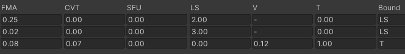

# 基于Malioc静态分析Shader
## Mali Offline Compiler
`malioc` 是`arm`推出的基于`mali GPU`的`shader`离线静态分析工具.

支持以下GPU
```
• Mali-T700 series (Midgard architecture)
• Mali-T800 series (Midgard architecture)
• Mali‑G31 (Bifrost architecture)
• Mali‑G51 and Mali‑G52 (Bifrost architecture)
• Mali‑G71, Mali-G72, and Mali-G76 (Bifrost architecture)
• Mali‑G57, Mali‑G68, Mali‑G77, and Mali‑G78 (Valhall architecture)
```

## 使用方法
命令行输入
```
malioc -c <target_gpu> [<shader_type>] <file1> [<file2> …] [-o <file>]
```
`shader_type`可输入
```
• --vertex
• --tessellation_control
• --tessellation_evaluation
• --geometry
• --fragment
• --compute
```
如果`file`已经使用了以下扩展名则无需指定`shader_type`
```
.vert OpenGL ES vertex shader.
.tesc OpenGL ES tessellation control shader.
.tese OpenGL ES tessellation evaluation shader.
.geom OpenGL ES geometry shader.
.frag OpenGL ES fragment shader.
.comp OpenGL ES compute shader.
```
用`-D`可以定义`Shader`中的宏来执行部分代码
```
-Dfoo
定义foo为1
-Dfoo=bar
定义foo为bar的值
```
## 性能分析
执行以下命令行代码
```
$ malioc.exe Unlit-test-LOD100.vert
```

得到以下性能数据
```
Mali Offline Compiler v7.4.0 (Build 330167)
Copyright 2007-2021 Arm Limited, all rights reserved

Configuration
=============

Hardware: Mali-G710 r0p0
Architecture: Valhall
Driver: r32p0-00rel0
Shader type: OpenGL ES Vertex

Main shader
===========

Position variant
----------------

Work registers: 19
Uniform registers: 44
Stack spilling: false
16-bit arithmetic: 0%

                              FMA     CVT     SFU      LS       T    Bound
Total instruction cycles:    0.25    0.00    0.00    2.00    0.00       LS
Shortest path cycles:        0.25    0.00    0.00    2.00    0.00       LS
Longest path cycles:         0.25    0.00    0.00    2.00    0.00       LS

FMA = Arith FMA, CVT = Arith CVT, SFU = Arith SFU, LS = Load/Store, T = Texture

Varying variant
---------------

Work registers: 7
Uniform registers: 12
Stack spilling: false
16-bit arithmetic: 0%

                              FMA     CVT     SFU      LS       T    Bound
Total instruction cycles:    0.02    0.00    0.00    3.00    0.00       LS
Shortest path cycles:        0.02    0.00    0.00    3.00    0.00       LS
Longest path cycles:         0.02    0.00    0.00    3.00    0.00       LS

FMA = Arith FMA, CVT = Arith CVT, SFU = Arith SFU, LS = Load/Store, T = Texture

Shader properties
=================

Has uniform computation: false
```
看到`vertex shader`被分为了`Position variant`和`Varing variant`两段. 在`Bifrost`和`Valhall`架构上, `.vert`会被`Index-Driven Vertex Shading (IDVS)`管线编译成两个`binaries`
- `Position shader`: 只有`position`相关计算
- `Varying Shader`: 计算剩下的所有`vertex attribute`


`Pos shader`对每一个索引顶点都会执行, `Varying shader`只对剔除后的可见图元执行, 所以这两个`shader`的数据被分开表示.\
原文:
```
The position shader is executed for every index vertex, but the varying shader is only executed for
vertices that are part of a visible primitive that survives culling. Mali Offline Compiler reports separate
performance tables for each of these variants.
```
## Mali GPU 静态分析数据项
### Bifrost架构
- `Arithmetic unit (A) `\
  计算单元
- `Load/store unit (LS)`\
  执行所有非Texture的内存访问, 包括buffer, image和原子操作
- `Varying unit (V)`\
  执行变量插值
- `Texture unit (T)`\
  执行所有纹理采样和过滤操作


#### Work registers
`Bifrost GPU shader core` 可以创建多个线程, 取决于正在使用的`Shader programs`的`work registers`数量
- `0-32 registers`: Maximum thread capacity
- `33-64 registers`: Half thread capacity
  
所以如果比起`highp`, 尽可能使用更多的`mediump`的话就能创建更多线程来让`GPU`的负载上升从而提高性能

### Valhall architecture
`Valhall`有6种并行管线, 其中3种`arithmetic`管线和3种`fixted function support`管线
1. `Arithmetic fused multiply accumulate unit (FMA)`\
   FMA管线构建了16-wide warp, 每线程每时钟周期可以发出一个32-bit操作或者两个16bit操作\
   `The FMA pipelines are the main arithmetic pipelines, implementing the floating-point
multipliers that are widely used in shader code. Each FMA pipeline implements a 16-wide warp,
and can issue a single 32-bit operation or two 16-bit operations per thread and per clock cycle.
`
2. `Arithmetic convert unit (CVT)`\
   `The CVT pipelines implement simple operations, such as format conversion and integer
addition.`
3. `Arithmetic special functions unit (SFU)`\
   特殊运算单元, 用于执行倒数和超越函数. `Each SFU pipeline implements a 4-wide issue
path, executing a 16-wide warp over 4 clock cycles`
   ```
   超越函数: https://zh.wikipedia.org/wiki/%E8%B6%85%E8%B6%8A%E5%87%BD%E6%95%B8
   ```
4. 5.6. `Load/store unit (LS)`, `Varying unit (V)`和`Texture unit (T)`


## 测试各项数据
### Texture

采样9次
```
#version 300 es

precision highp float;
precision highp int;
#define UNITY_SUPPORTS_UNIFORM_LOCATION 1
#if UNITY_SUPPORTS_UNIFORM_LOCATION
#define UNITY_LOCATION(x) layout(location = x)
#define UNITY_BINDING(x) layout(binding = x, std140)
#else
#define UNITY_LOCATION(x)
#define UNITY_BINDING(x) layout(std140)
#endif
UNITY_LOCATION(0) uniform mediump sampler2D _MainTex;
in highp vec2 vs_TEXCOORD0;
layout(location = 0) out mediump vec4 SV_Target0;
vec4 u_xlat0;
mediump vec4 u_xlat16_0;
vec4 u_xlat1;
mediump vec4 u_xlat16_1;
mediump vec4 u_xlat16_2;
void main()
{
    u_xlat0 = vs_TEXCOORD0.xyxy + vec4(-1.0, 1.0, 0.0, 1.0);
    u_xlat16_1 = texture(_MainTex, u_xlat0.xy);
    u_xlat16_0 = texture(_MainTex, u_xlat0.zw);
    u_xlat0 = u_xlat16_0 + u_xlat16_1;
    u_xlat1 = vs_TEXCOORD0.xyxy + vec4(1.0, 1.0, -1.0, 0.0);
    u_xlat16_2 = texture(_MainTex, u_xlat1.xy);
    u_xlat16_1 = texture(_MainTex, u_xlat1.zw);
    u_xlat0 = u_xlat0 + u_xlat16_2;
    u_xlat0 = u_xlat16_1 + u_xlat0;
    u_xlat16_1 = texture(_MainTex, vs_TEXCOORD0.xy);
    u_xlat0 = u_xlat0 + u_xlat16_1;
    u_xlat1 = vs_TEXCOORD0.xyxy + vec4(1.0, 0.0, -1.0, -1.0);
    u_xlat16_2 = texture(_MainTex, u_xlat1.xy);
    u_xlat16_1 = texture(_MainTex, u_xlat1.zw);
    u_xlat0 = u_xlat0 + u_xlat16_2;
    u_xlat0 = u_xlat16_1 + u_xlat0;
    u_xlat1 = vs_TEXCOORD0.xyxy + vec4(0.0, -1.0, 1.0, -1.0);
    u_xlat16_2 = texture(_MainTex, u_xlat1.xy);
    u_xlat16_1 = texture(_MainTex, u_xlat1.zw);
    u_xlat0 = u_xlat0 + u_xlat16_2;
    u_xlat0 = u_xlat16_1 + u_xlat0;
    SV_Target0 = u_xlat0 * vec4(0.111111112, 0.111111112, 0.111111112, 0.111111112);
    return;
}

```
分析结果



### Load & Store
